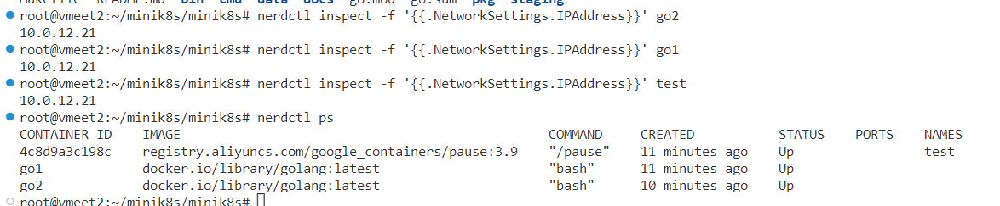
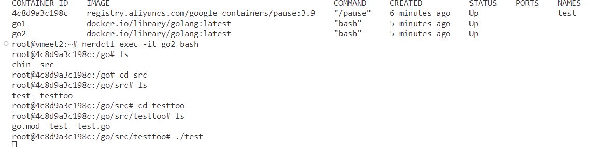
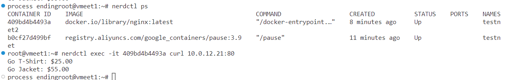
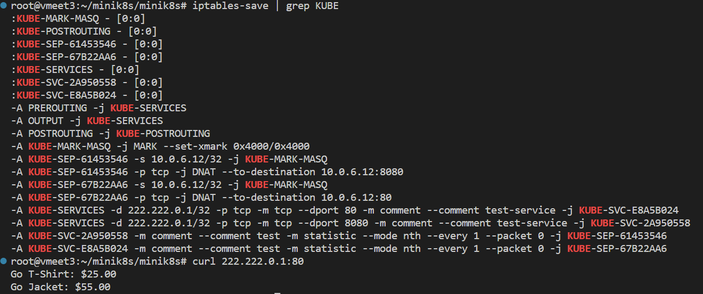
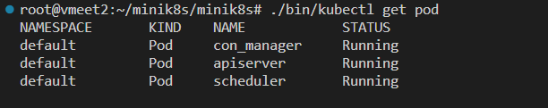
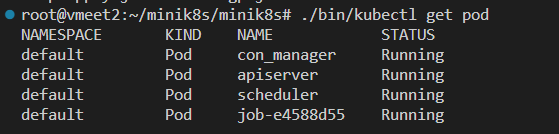
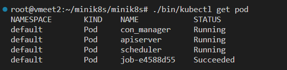

## Simple usage

-   cd minik8s
-   make
-   /bin/kubeadm version
-   /bin/vctl [command flag]
-   /bin/nervctl [command flag]

## Build a Simple Pod using nervctl
-   ./bin/nervctl runp test
-   add two container to the pod
    -   ./bin/nervctl run golang:latest go1 8000:8000 /root/test_vo:/mnt container:test bash
    -   ./bin/nervctl run golang:latest go2 8000:8000 /root/test_vo:/go/src container:test bash
-   after the above step, we can find that this two container shared vloume and network (can use localhost to communicate)

## CNI TEST
-   First, run a pod using nervctl and check its ipaddress
    ```
    nerdctl inspect -f '{{.NetworkSettings.IPAddress}}' test
    ```
    

-   Second, run http server in the pod

    

-   Third, using curl in other node to test the network

    


## Controller 使用流程

### 启动

`./bin/apiserver`启动apiserver  
`./bin/kubelet`启动kubelet  
`./bin/scheduler`启动scheduler  
`./bin/kubeadm join --config=./testcases/vmeet1.yaml`加入集群  
`./bin/kube-controller-manager`启动所有controller  

### 使用Deployment controller创建deployment实例  

`./bin/kubectl apply <filename>`(expmple: `./bin/kubectl apply ./cmd/kubectl/app/src/test_deployment.yaml`)创建deployment实例  
`nerdctl ps`可以看到启动了`replicas`数量的pod和container  

### 使用Autoscaler controller创建autoscaler实例 

执行`./bin/kubectl apply <filename>`(expmple: `./bin/kubectl apply ./cmd/kubectl/app/src/test_autoscaler.yaml`)创建autoscaler实例  


## Service功能

> Service中的selector字段会去匹配pod的label字段，进而实现Servcie端口的映射(目前仅支持app标签匹配)

### 启动
`./bin/apiserver`启动apiserver  
`./bin/kubelet`启动kubelet  
`./bin/scheduler`启动scheduler  
`./bin/kubeadm join --config=./testcases/vmeet2.yaml`加入集群  

### 使用

`./bin/kubectl apply <service.yaml>` 创建Service服务
`./bin/kubectl get service` 查看创建的Service的状态、ClusterIP以及Port等信息
`./bin/kubectl delete <serviceName>` 删除name为serviceName的Service服务

### 使用效果
> Apply Service后，可以通过虚拟IP访问服务，同时IPtables规则也会修改，具体效果如下所示




## Function功能

### 启动
`./bin/apiserver`启动apiserver  
`./bin/kubeadm join --config=./testcases/vmeet1.yaml`加入集群  
`./bin/kubelet`启动kubelet  
`./bin/scheduler`启动scheduler  
`./bin/kube-controller-manager`启动所有controller  
`./bin/knative`启动knative

### 注册
`./bin/kubectl register ./pkg/serverless/app/func.py`

### 使用
`./bin/kubectl trigger func '{}'`


## GPU Usage
### Start Up
> ./bin/kubelet
-   effect

### Apply Job using kubectl
> ./bin/kubectl apply ./testcases/job.yaml
-   effect

-   after job finish

> run `cat /root/minik8s/minik8s/scripts/data/result.out` can get the job's result
