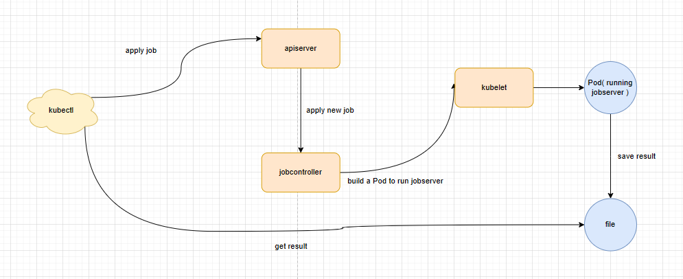

# Minik8s验收文档

## 1. 项目架构&各组件功能&软件栈
### MiniK8s的项目整体架构


### 各组件的功能

-   **Kubelet**
    
    - 通过实现File-Lister-Watcher使得Kubelet有能力去管理某一个文件目录下的配置文件对应的Pod，而在项目中我们将控制面（api server,controller manager,scheduler）以Pod的形式运行，保证了程序的鲁棒性，Kubelet会每隔一段时间去检查控制面的状态，确保控制面保持在启动状态，同时我们通过File-Lister-Watcher实现了控制面配置的实时更新，当我们修改对应目录下控制面的配置文件，在10s内就会有新的控制面启动（以新的配置），增强了程序的弹性。
    - 同时，在Kubelet中通过Containerd go client实现了CAdvisor的构建，实现对于CPU和Memory的实时监控
    - 实现了对于Pod的创建和删除以及Pod状态（比如IP等等）状态的获取
    - 各组件和kubelet交互的方式有两种，一种是http请求，另一种是List watch机制，而list watch机制又分两种情况，如下图所示
    
    
    
-   **kubeadm**
    
    > 使用go的cobra包作为kubeadm构建的基础，功能如下：
    >
    - kubeadm init：产生控制面的配置文件，并存放到特定的目录下，启动kubelet的时候会根据对应目录下的yaml文件启动控制面
    - kubeadm join：加入到某个特定的集群中
    - kubeadm version：输出版本号

- **kubectl**

  > 命令行工具

- **CNI**
  
  > 使用flannel配合etcd cluster作为网络插件搭建的基础
  
- **deployment controller**

  > 负责管理deployment和所属pod

- **autoscaler controller**

  > 负责进行自动扩缩容

- **jobcontroller**

  > 负责产生slurm脚本并进行运行相应的job Pod进行任务的提交和结果的获取。

- **Scheduler**

  - 实现了RR调度策略
  - 实现了Affinity的调度策略
  - 实现了基于资源的调度策略

- **Kubeproxy**

  -   管理Service网络规则的部署和删除
  -   管理DNS功能的部署和删除

- **Apiserver**

  - 实现各个API对象在etcd中的CRUD操作
  - 集成list-watch接口，进行消息发布与接收

- **Knative**

  > Serverless功能的控制器

  - 管理Function的Register, Trigger, Update和Delete
  - 解析Workflow，按照Workflow DAG调用函数

### 软件栈

- **Nginx**：使用了Nginx反向代理的功能
- **go-iptables/iptables**：进行iptables规则管理
- **etcd**：进行持久化存储
- **Redis**：消息中间件，用于实现list-watch机制
- **Cobra**：命令行工具，解析终端输入的命令
- **containerd-go-client**: 使用go驱动container的工具
- **fsnotify**: 监听文件系统操作，实现file-list-watch机制
- **flannel**: CNI插件
- **expect**: 使用expect框架进行ssh自动连接（GPU任务）
- **nerdctl**: 辅助进行container的管理


## 2. 分工和贡献度

|  姓名  |                             分工                             | 贡献度 |
| :----: | :----------------------------------------------------------: | :----: |
| 魏靖霖 | Pod抽象，CNI插件的部署，GPU应用的支持，动态扩缩容的资源监控功能，多机Minik8s的Node和调度功能，容错的Pod部分 |    37%    |
|  王劭  | Service和DNS功能, 容错中的Service部分,多机Minik8s中的Service部分, Serverless中的Function和Workflow部分 |    33%    |
| 宋峻青 | Deployment和Autoscaler功能，容错和多机Minik8s中的Deployment和Autoscaler部分，serverless的scaler部分 |    30%    |


## 3. 项目详细信息
- **gitee目录**：git@gitee.com:jinglinwei/minik8s.git

-   **分支介绍**：
    
    - master：主分支
    - develop：开发时用于同步协作的分支
    
    -   kubeadm：对应与kubeadm命令行工具的开发
    -   kubectl：对应于kubectl命令行工具的开发
    -   GPU：对应于GPU功能
    -   CNI：对应于CNI功能
    -   kubelet：对应kubelet和Pod抽象
    -   Node：对应多机的Node和Scheduler功能
    -   service：对应于Service功能
    -   dns：对应于DNS功能
    -   apiserver：对应于apiserver构件
    -   serverless/ws：对应于Serverless功能中Function抽象以及Workflow功能
    -   deployment：对应Deployment功能
    -   autoscaler：对应Autoscaler功能
    -   serverless/sjq：对应于Serverless功能中的scaler功能
    
- **CI/CD介绍**

  > 我们的CI/CD方法基于GitLab RUnner

  - CI/CD配置文件在`.gitlab-ci.yml`中，分为build和test两个stage
  - 我们将云服务器中的`gitlab-runner`注册到了Gitlab项目中
  - 使用我们自己配置的依赖镜像，安装了etcd, nginx等依赖环境

-   **软件测试方法**
    
    - 对于每个模块编写go test文件进行单元测试
    - 对于整个大的功能进行集成测试


## 4. 各个功能点
### Pod
>   1.  创建Pod:kubectl apply xxx.yaml根据yaml文件的内容创建Pod
>   2.  删除Pod:kubectl delete pod name，删除对应的Pod
>   3.  实现了Pod内部网络和Volume的共享
>   4.  实现了对于Pod的所有定制化功能（包括资源限制和CMD的指定等等）
>   5.  查看Pod状态：kubectl get pod可以查看所有Pod的状态
>   6.  Pod的调度：实现了RR，Affinity和基于资源的调度策略（一共三种）

- **实现细节**
  
  - 架构图如下
    
  - 具体实现思路：
    - 先运行一个pause容器，然后其他容器加入pause容器的网络中
    - 对于Volume的挂载，实现思路是hostPath类型的挂载，我们让多个容器和主机文件系统中的文件路径进行挂载，实现共享的Volume
    - 通过解析yaml文件中的labels字段，采取不同的调度策略，RR策略实现很简单就是维护一个循环队列即可，Affinity策略也很简单：指定对应的Node即可，基于资源的调度需要我拿到Node中的资源使用情况，选择资源最丰富的Node即可
  
- **实际使用**
  
  - 启动
  ```shell
    $ ./bin/kubeadm init
    $ ./bin/kubeadm join --config=xxx.yaml (在另一台机子上也执行对应的指令join Master Node)
  ```
  - 运行Pod
  ```shell
    $ ./bin/kubectl apply xxx.yaml
  ```
  - 查看状态
  ```shell
    $ ./bin/kubectl get pod
  ```
  - 删除Pod
  ```shell
    $ ./bin/kubectl delete pod pod_name
  ```
  - 不同调度策略的yaml文件示例
    - RR（默认调度策略）
    ```yaml
    kind: Pod
    metadata:
      name: rr_one
      labels:
        app: podTest
    spec:
      volumes:
        - name: shared-data
          hostPath: /root/test_vo
    
      containers:
    
        - name: onerr
          image: docker.io/library/golang:latest
          resources:
            limits:
              cpu: "0.5"
            requests:
              cpu: "0.25"
          volumeMounts:
            - name: shared-data
              mountPath: /mnt
          ports:
            - containerPort: 8080
          command:
            - bash
    
        - name: tworr
          image: docker.io/library/golang:latest
          resources:
            limits:
              memory: "200MiB"
            requests:
              memory: "200MiB"
          volumeMounts:
            - name: shared-data
              mountPath: /go/src
          ports:
            - containerPort: 80
    
          command:
            - bash
    ```
    - Affinity调度策略(下面的例子绑定到Vmeet2节点)
    ```yaml
    kind: Pod
    metadata:
      name: rr_one
      labels:
        app: podTest
        node:vmeet2
    spec:
      volumes:
        - name: shared-data
          hostPath: /root/test_vo
    
      containers:
    
        - name: onerr
          image: docker.io/library/golang:latest
          resources:
            limits:
              cpu: "0.5"
            requests:
              cpu: "0.25"
          volumeMounts:
            - name: shared-data
              mountPath: /mnt
          ports:
            - containerPort: 8080
          command:
            - bash
    
        - name: tworr
          image: docker.io/library/golang:latest
          resources:
            limits:
              memory: "200MiB"
            requests:
              memory: "200MiB"
          volumeMounts:
            - name: shared-data
              mountPath: /go/src
          ports:
            - containerPort: 80
    
          command:
            - bash
    ```
    - 基于内存资源的调度策略
    ```yaml
    kind: Pod
    metadata:
      name: rr_one
      labels:
        app: podTest
        resourcePolicy: on
    spec:
      volumes:
        - name: shared-data
          hostPath: /root/test_vo
    
      containers:
    
        - name: onerr
          image: docker.io/library/golang:latest
          resources:
            limits:
              cpu: "0.5"
            requests:
              cpu: "0.25"
          volumeMounts:
            - name: shared-data
              mountPath: /mnt
          ports:
            - containerPort: 8080
          command:
            - bash
    
        - name: tworr
          image: docker.io/library/golang:latest
          resources:
            limits:
              memory: "200MiB"
            requests:
              memory: "200MiB"
          volumeMounts:
            - name: shared-data
              mountPath: /go/src
          ports:
            - containerPort: 80
    
          command:
            - bash
    ```
    - 共享网络和Volume的部已经在视频中演示了，比较复杂，这里不再赘述。


### GPU
>   1. 实现了GPU任务的提交和任务的实时监控，通过kubectl apply job.yaml提交任务，通过kubectl get job和kubectl get pod来查看job运行的情况
>   2. 可以通过kubectl get job name来获取job的result
- **实现细节**
  
  - 架构图如下
  
  - 运行逻辑和具体的实现：
    
    > 编写DockerFile，构建一个镜像，这个镜像可以自动进行SSH连接（通过expect框架实现），在镜像内部我们会运行一个jobserver（通过文件挂载使得容器内部拥有jobserver的可执行文件），这个jobserver会上传对应的cuda程序和slurm脚本，并轮询GPU计算节点，询问任务是否完成。在任务完成之后，我们可以通过kubectl去对应的文件中获取输出结果
- **具体使用**：
  
  - 启动步骤和Pod部分相同
  - 提交任务
  ```shell
    $ ./bin/kubectl apply ./testcases/job.yaml
  ```
  - 查看任务状态
  ```shell
    $ ./bin/kubectl get jobs //获取所有job对应的Pod
    $ ./bin/kubectl get pod // 查看Pod状态（Succeed代表Job已经完成）
  ```
  - 查看任务结果
  ```shell
    $ ./bin/kubectl get job gpujob // 或者直接去查看对应的result文件
  ```
  - yaml文件示例
  ```yaml
  kind: Job
  metadata:
    name: gpujob
  spec:
    partition: dgx2
    threadNum: 1
    taskPerNode: 1
    cpu_per_task: 6
    gpu-num: 1
    file: result
    codePath: /root/minik8s/minik8s/scripts/data/add.cu
  ```


### Service

> 1. Service支持**Host-to-Pod**和**Pod-to-Pod**两种访问方式，用户可以在Host和Pod上通过`ClusterIP:port`的方式去访问Pod
> 2. Service支持**单机访问**、**跨多机访问**以及**多Pod的映射**

- **功能架构图**


- **Service运行逻辑**

  1. 通过`kubectl`向Mater Node上的Apiserver发送apply service的请求

  2. Apiserver调用`ipgen`模块为新创建的service分配一个虚拟地址(clusterIP)，同时将相关信息持久化到etcd中，再向Redis中publish一条`/service/apply`的信息

  3. 所有subscribe了`/service/apply`的Kubeproxy收到消息，调用`iptables`模块，更改Linux内核中相关的iptables规则和链

     > 我们在每个节点上都有kubeproxy，在启动时便会subscribe`/service/apply`等消息

  4. 接下来我们可以通过`kubectl get service`查看service相关的信息，并用`clusterIP:port`的方式去访问Pod

- **Service具体的实现**
  - `ipgen`模块：为Service分配`222.222.0.0/16`网段的虚拟IP地址，根据调用次数变化
  - `kubeproxy`模块：监听Redis中相关topic，在topic publish出来后调用Service的handler
  - `Apiserver`模块：持久化service数据，调用`ipgen`模块分配地址，向Redis中publish相关消息
  - `iptables`模块：基于`go-iptables`包提供的接口，创建相关的Service规则(基于**Linux IPtables**去实现)
    - 相关的chains：
      1. `KUBE-SERVICES`：`Prerouting`和`Output`系统内置链会跳到`KUBE-SERVICES`上
      2. `KUBE-POSTROUTING`：`Postrouting`系统内置链会跳到`KUBE-POSTROUTING`上
      3. `KUBE-SVC-xxxxxxxx`：对应于不同Service上不同的端口映射关系，`KUBE-SERVICES`链会根据(ClusterIP, Port)的不同组合跳转到不同的`KUBE-SVC-xxxxxxx`链上
      4. `KUBE-SEP-xxxxxxxx`：对应于不同的Pod，`KUBE-SVC-xxxxxxxx`会根据负载均衡策略（我们这里采用的是Round-Robin策略）去将流量转发到不同的`KUBE-SEP-xxxxxxxx`上，并由`KUBE-SEP-xxxxxxxx`做DNAT映射
      5. `KUBE-HOST-MARK`：为来自于主机的请求打上`0x6000/0x6000`的标签，用于在`POSTROUTING`链上筛选需要做SNAT的包。来自主机的请求会通过SNAT映射到`flannel.1`网卡的IP地址上，用于跨多机的`Host-to-Pod`流量访问
  
- **Service功能的使用**

  - 启动

  ```shell
  $ ./bin/apiserver 						#启动apiserver  
  $ ./bin/kubelet							#启动kubelet  
  $ ./bin/scheduler						#启动scheduler  
  $ ./bin/kubeadm join --config=./testcases/vmeet2.yaml 	#加入集群  
  ```

  - 使用

  ```shell
  $ ./bin/kubectl apply <service.yaml> 		#创建Service服务  
  $ ./bin/kubectl get service #查看创建的Service的状态、ClusterIP以及Port等信息  
  $ ./bin/kubectl delete <serviceName> #删除name为serviceName的Service服务
  ```

  - yaml文件示例

  ```yaml
  kind: Service
  metadata:
    name: servicePodTest	# serviceName
  spec:
    ports:				# 定义了service的端口到pod端口的映射关系
    - name: go1-port
      protocol: TCP
      port: 8080
      targetPort: 8080
    - name: go2-port
      protocol: TCP
      port: 80
      targetPort: 80
    selector:				# 对Pod的匹配字段
      app: podAffTest		# 匹配metadata.labels中app字段为podAffTest的Pod
  ```

  

### DNS

> 1. DNS支持**Host-to-Pod**和**Pod-to-Pod**两种访问方式，用户可以在Host和Pod上通过`hostname:80/subpath`的方式去访问Pod
> 2. DNS支持**单机访问**、**跨多机访问**

- **功能架构图**


- **DNS运行逻辑**

  1. 通过`kubectl`向Mater Node上的Apiserver发送apply dns的请求

  2. Apiserver将相关信息持久化到etcd中，再向Redis中publish一条`/dns/apply`的信息

  3. 所有subscribe了`/dns/apply`的Kubeproxy收到消息，调用`nginx`模块和`hosts`模块，分别更改nginx配置文件并reload Nginx，更改/etc/hosts文件

     > 我们在每个节点上都有kubeproxy，在启动时便会subscribe`/dns/apply`等消息

  4. 接下来我们可以通过`kubectl get dns`查看service相关的信息，并用`hostname:80/subpath`的方式去访问Pod

- **DNS功能的具体实现**

  - `kubeproxy`模块：监听Redis中相关topic，在topic publish出来后调用Service的handler
  - `Apiserver`模块：持久化service数据，调用`ipgen`模块分配地址，向Redis中publish相关消息
  - `hosts`模块&`nginx`模块：对`/etc/hosts`以及`nginx.conf`等配置文件进行更改
  - 此外，我们为了保持主机与Pod域名解析的一致性，我们用**共享目录**的方式将`/etc/hosts`**文件挂载**到Pod中每一个容器中相应的地址，实现了域名解析的功能。然后将域名定位到本机，这时监听在80端口的Nginx便会收到请求，然后Nginx会根据`nginx.conf`中的配置将流量转发到Service分配的虚拟IP中（**反向代理**），从而实现了DNS服务。

- **DNS功能的使用**

  - 启动

  ```shell
  $ ./bin/apiserver 						#启动apiserver  
  $ ./bin/kubelet							#启动kubelet  
  $ ./bin/scheduler						#启动scheduler  
  $ ./bin/kubeadm join --config=./testcases/vmeet2.yaml 	#加入集群  
  ```

  - 使用

  ```shell
  $ ./bin/kubectl apply <dns.yaml> 		#创建DNS服务  
  $ ./bin/kubectl get dns #查看创建的dns的状态、域名、子路径以及对应的Service信息  
  $ ./bin/kubectl delete <serviceName> #删除name为dnsName的DNS服务
  ```

  - yaml文件示例

  ```yaml
  kind: DNS
  metadata:
    name: test-dns		# dnsName
  spec:
    host: minik8s.io		# 主路径
    subpaths:
    - path: /test1		# 子路径
      service: servicePodTest	# 对应的service的name
      port: 80				# 对应的service的port
    - path: /test2
      service: servicePodTest
      port: 8080
  ```


### Deployment

- **实现的功能**：
  
  - 通过`kubectl apply <filename>`读取yaml文件创建Deployment，主要包含`name`，`replicas`，`template`字段，分别为deployment的名字，创建的副本数量和创建的pod的信息，`Deployment controller`会按照yaml文件创建对应的pod
  - `Deployment controller`会维护pod的数量为`replicas`，如果有pod停止运行，会创建新的pod
  - `Deployment controller`创建的pod可调度到多机，并且可管控多机pod的状态
  
- **架构逻辑**：

  

  `Deployment controller`向`apiserver`注册回调函数，`apiserver`监听到Deployment的变化，通过`listwatch`通知`Deployment controller`，`Deployment controller`进行相应的处理

- **实现方式**：

  - 创建`Deployment`：在用户使用`kubectl apply`部署后，kubectl会解析yaml文件内容为`Deployment`结构体，并访问`apiserver`，储存入`etcd`中，并通知`Deployment controller`，`Deployment controller`通过`apiserver`创建pod，并调度到不同node

  - 工作流程：minik8s会启动`Deployment controller`和`apiserver`，所有对`Deployment`对象的修改都经过`apiserver`，当`Deployment`发生改变时，`apiserver`通过`listwatch`机制将`Deployment`和相应的操作（增删改）传递给`Deployment controller`，`Deployment controller`会向`apiserver`注册一个`listener`函数并维持一个`worker`线程，`listener`将发生改变的`Deployment`传入`working queue`，`worker`则会不断检查`working queue`，如果不为空则将队列中的元素出队并进行处理。  处理分以下三种情况：
    1. `Apply`：新创建的`Deployment`，根据`Template`信息创建 `replicas`数量的pod，并将Deployment和Pod的对应关系存入`map`中
    2. `Update`：`autoscaler`对Deployment的`replicas`进行修改，根据新旧`replicas`数量进行增加或删除pod操作
    3. `Delete`：用户删除Deployment，需要删除该Deployment对应的所有的Pod

  - 维护pod数量：由于pod自行停止不会导致`apiserver`进行`listwatch`操作，所以`Deployment controller`需要定期通过`apiserver`向`kubelet`查询正在运行的pod的数量，如果发现有Deployment对应的pod少于`replicas`，则创建pod直到数量相符

- **Deployment的使用**

  - 启动

    ```bash
    $ ./bin/kubelet							#启动控制面
    $ ./bin/kubeadm join --config=./testcases/vmeet2.yaml 	#加入集群 
    ```

  - 使用

    ```bash
    $ ./bin/kubectl apply ./testcases/test_deployment.yaml	#创建deployment
    $ ./bin/kubectl get deployment		#查看deployment
    $ ./bin/kubectl delete deployment deployment_test 	#删除deployment:deployment_test
    ```

  - yaml文件实例

    ```yaml
    kind: Deployment
    metadata:
      name: deployment_test		#名称
    spec: 
      replicas: 2				#pod副本数量
      template: 				#pod信息
      kind: Pod
        metadata:
          name: test
          labels:
            app: deploymentServiceTest
        spec:
          volumes:
          - name: shared-data
            hostPath: /root/test_vo
        
          containers:
          - name: go1
            image: docker.io/library/golang:latest
            volumeMounts:
              - name: shared-data
                mountPath: /mnt
            ports:
              - containerPort: 8080
            command: 
              - bash
    ```

### Autoscaler

- **实现的功能**：
  
  - 通过`kubectl apply <filename>`读取yaml文件创建Autoscaler，主要包含`name`，`targetRef`，`minReplicas`，`maxReplicas`，`scaleIntervel`，`metrics`字段，分别为autoscaler的名字，扩缩容目标Deployment的名字，最大/最小副本数，扩缩容间隔，以及监控的资源信息
  - `Autoscaler controller`可以收集目标Deployment所属的pod的资源信息，并进行管控，当pod资源使用率较低时降低replicas数量，pod使用率较高时增加replicas数量
  - 可以设置扩缩容的速度，即多少秒增加或减少一个副本
  - 底层封装了基于Containerd的CAdvisor作为资源收集的单元
  
- **架构逻辑**

  

  `Autoscaler controller`通过访问`kubelet`获取pod的`metrics`，如果要进行扩缩容，则修改对应Deployment的`replicas`字段，交给`apiserver`进行`update`操作，`Deployment controller`会根据信息进行创建或删除pod

- **实现方式**：
  
  - 创建`Autoscaler`：使用`kubectl apply`部署后，`kubectl`会解析yaml文件内容为`Autoscaler`结构体，并访问`apiserver`，储存入`etcd`中，`Autoscaler controller`向`apiserver`注册`Apply`操作的回调函数，当新的`Autoscaler`被创建时，`Autoscaler controller`将其加入记录了正在运行的Autoscaler的数组。
  - 工作流程：`Autoscaler controller`会不断根据数组记录的Autoscaler，通过`apiserver`向`kubelet`查询其Deployment所属的pod的资源利用率，并计算出平均利用率，与设置的标准进行对比，决定增加或减少`replicas`数目，创建新的Deployment结构，调用`apiserver`的`Update Deployment`接口进行更新
  - 获取pod资源利用率：
    - 实现架构
    
    - 实现思路：在底层使用contained go client去获取资源的信息（通过自己实现的ContainerListener对象实现这个功能），在上层的CAdvisor(针对Pod级别的资源获取)通过获取该Pod内的每个Container的资源使用情况进行汇总得到Pod的资源使用情况。Kubelet可以向CAdvisor实时获取该资源使用情况
  - 删除Autoscaler：`Autoscaler controller`向`apiserver`注册`Delete`操作的回调函数，当Autoscaler被删除时，将其移出队列
  
- **Autoscaler**的使用

  - 启动

    ```bash
    $ ./bin/kubelet							#启动控制面
    $ ./bin/kubeadm join --config=./testcases/vmeet2.yaml 	#加入集群 
    ```

  - 使用

    ```bash
    $ ./bin/kubectl apply ./testcases/test_autoscaler.yaml	#创建autoscaler
    $ ./bin/kubectl get autoscaler		#查看autoscaler
    $ ./bin/kubectl delete autoscaler autoscaler_test 	#删除autoscaler:autoscaler
    ```

  - yaml文件实例

    ```yaml
    kind: HorizontalPodAutoscaler
    metadata: 
      name: autoscaler_test				#名称
    spec:
      maxReplicas: 3					#最大副本数
      minReplicas: 1					#最小副本数
      scaleIntervel: 10					#扩缩容间隔
      scaleTargetRef:					#扩缩容对象信息
        kind: Deployment
        name: deployment_test
      metrics:							#扩缩容限制资源
      - resource:
          name: cpu
          strategy: average
          utilization: 20
      - resource:
          name: memory
          strategy: average
          utilization: 50
    ```

    

### 容错

- **Service部分**

  > 由于我们Service的实现方式是基于iptables的，因此它并不会因为控制面Crash掉而出现问题，即使控制面无法重启，已经注册的Pod依然可以通过`ClusterIP:port`的方式去访问

- **同时我们间接实现了DNS的容错**

  > 控制面重启并不会影响Nginx的正常运行，同时由于Service的iptables规则不受控制面Crash的影响，因此

- **Pod部分**
  
  > 通过把Pod的状态同步到etcd cluster中实现持久化，我们可以实现容错

- **Deployment**

  > 效果：`Deployment controller`在重启后仍能维护已创建的Deployment所属的pod的数量为`replicas`

  > 实现：`Deployement controller`的状态包括一个工作队列`queue`和记录一个Deployment到Pod映射关系的`map`，其中`queue`是对Deployment的待处理操作，不需要恢复，而`map`在启动`Deployement controller`会读取`etcd`的持久化信息获取Deployment和pod的对应关系，恢复状态

- **Autoscaler**

  > 效果：`Autoscaler controller`在重启后仍能对Deployment进行动态扩缩容

  > 实现：`Autoscaler controller`的状态包含一个记录了活跃的`Autoscaler`的队列，在重启时访问`etcd`中的持久化数据即可恢复状态


### 多机Minik8s
> 1. 实现了Node的抽象
> 2. 实现了三种调度策略（不过已经在Pod中提到了，不再赘述）

- **功能架构图**

- **具体实现逻辑和细节**

  - Node注册：首先在一个Node中通过kubeadm命令行工具join到Master Node上，这些信息会被持久化到etcd中，实现对于Node的注册
  - Scheduler:在apply一个Pod的时候，首先会向apiserver发消息，apiserver向Scheduler发送请求，得到调度的Node的信息，然后通过http请求向对应的kubelet发送创建Pod的请求

- **具体使用**

  - Node的使用
    - join node
    ```shell
    // on vmeet2(node)
    $ ./bin/kubeadm init
    $ ./bin/kubelet
    $ ./bin/kubeadm join --config=./testcases/vmeet2.yaml
    // on vmeet1(node)
    $ ./bin/kubeadm join --config=./testcases/vmeet1.yaml
    ```
    - list node
    ```shell
    // on vmeet2(node)
    $ ./bin/kubectl get nodes
    ```
    - delete node
    ```shell
    // on vmeet2(node)
    $ ./bin/kubectl delete node vmeet1
    ```
  - Scheduler的具体使用，已经在Pod部分中介绍了
  - Node部分的yaml文件示例
  ```yaml
  kind: Node
  metadata:
    name: vmeet1
  spec:
    masterIp: 192.168.1.6
    nodeIp: 192.168.1.5
  ```


### Serverless

#### Function

> Function支持**Register**, **Update**, **Delete**以及**Trigger**功能

- **功能架构图**


> 上图为Register和Trigger的功能架构图，其它的功能为：
>
> Update：将更新过的<funcname.py>复制到挂载目录下，完成更新
>
> Delete：与删除Deployment的过程类似，向Apiserver发起删除请求，同时删除etcd存储的Function信息

- **Register的运行逻辑**
  1. 通过kubectl，
  
  2. 1. 向Knative传递文件路径信息
     2. Knative根据传递的文件路径信息：
        - 创建文件挂载的目录，将一些内置文件(main.py, requirements.txt, start.sh)以及要传入的文件拷贝到挂载目录下(传入文件需要改名为func.py)
        - 向Apiserver发起请求，创建Deployment，Deployment的Pod挂载`/root/func/<funcname>`目录到`/python/src`目录下
        - 启动Pod的同时调用`start.sh`脚本，启动Python Server(`main.py`文件)。Python Server会调用`func.py`，并向外提供HTTP访问接口
     3. 再调用`kubectl get func`就可以查看到函数注册信息了
  
  3. **Trigger的运行逻辑**
  
     1. 通过kubectl，向Knative发送trigger相关函数的请求
     2. Knative从Apiserver中获取相关Deployment以及Pod的信息，并采用Round-Robin的方式去调用部署的不同Pod，并将相关结果返回给用户
  
  4. **Function的具体实现**
  
     - `Knative`：一个HTTP Server，负责处理相关的请求调用
       - Register：创建目录、拷贝文件、向Apiserver发起创建Apiserver的请求
       - Trigger：向Apiserver发起请求检索对应的Pod，再向相关Pod发起请求，返回结果
       - Update：将更新过的文件复制到挂载目录下
       - Delete：删除Apiserver中Function信息，并调用删除Deployment的接口
     - 内置文件：
       - `main.py`：用Flusk框架编写的Python Server，将根域名`/`以及8080端口开放作为接受请求的接口。可以获取参数，调用同目录下的`func.py`，并向调用者返回结果
       - `requirements.txt`：一些Python包依赖
       - `start.sh`：启动脚本，安装包依赖以及启动Python Server
  
  5. **Function功能的使用**
  
     - 启动
  
       > 首先拉取Python的镜像
  
       ```shell
       $ nerdctl pull python:3.8.10
       ```
  
       > 启动相关的组件
  
       ```shell
       $ ./bin/apiserver
       $ ./bin/scheduler
       $ ./bin/kubelet
       $ ./bin/kube-controller-manager
       $ ./bin/knative
       ```
  
     - Register Function
  
       ```shell
       $ ./bin/kubectl register <path-to-python-file>
       ```
  
     - Trigger Function
  
       > - "funcName"是python file的名称前缀。比如说一个python file叫做`func.py`，那么它的"funName"就是`func`
       >
       > - "data"是一个JSON类型的字符串，它的值取决于注册的function。例如对于`./testcases`中的`Add.py`，合法的输入参数格式是`'{"x":1,"y":2}'`。如果这个function不需要参数，那么我们需要将data设置为`''`
  
       ```shell
       $ ./bin/kubectl trigger <funcName> <data>
       ```
  

#### Workflow

> Workflow支持**函数调用链**以及**分支**功能，但在与Scale-to-0和自动扩容模块的代码合并之后出现了问题，截至到答辩时间，我们未能解决这个问题

- **Workflow功能架构图**


- **Workflow运行逻辑**

  1. 通过kubectl，向Knatvie发送apply workflow的请求
  2. Knative收到请求，首先解析workflow，根据workflow中node字段（每个元素对应于一个function）去Apiserver中查询对应的Pod信息
  3. 按照workflow定义的顺序去向function对应的Pod发送请求，将前一个函数执行的结果作为下一个函数的输入。同时根据分支的匹配条件，决定执行流(control flow)

- **Workflow的具体实现**

  - workflow对象：

    - startAt字段：指定DAG的入口函数

    - params字段：入口函数对应的参数

    - nodes字段：DAG node数组，每个元素对应于不同的function

    - node对象中的不同字段：

      1. type：分为Task类型和Choice类型

         > Task：对应于一个Function，此种类型的node执行时会去trigger function
         >
         > Choice：条件分支判语句，会根据choices字段中不同的匹配条件去决定下一个执行的函数

      2. choice：不同的条件分支，其下的conditions字段表示匹配的条件，next字段表示下一个执行的函数

      3. next：下一个要执行的函数，如果没有该字段，则说明该分支控制流执行结束

  - Knative：解析workflow对象，按照workflow中定义的顺序以及条件分支，分别去trigger对应的function以及执行对应的条件判断语句

- **Workflow的使用**

  - 启动

    > 该部分与Function部分类似，不作赘述

  - Trigger Workflow

    ```shell
    $ ./bin/kubectl apply <workflow.yaml>
    ```

#### Scaler

- **实现功能**：在单机中能实现`scale-to-0`，`scale-to-N`和冷启动，在合并时出现问题，只有`scale-to-0`能够使用

- **架构逻辑**：

  

- **实现方式**：
  
  - scale-to-0：`scaler`对每个Functon维护一个计数器，计数器为0时，`scaler`修改Function对应的Deployment的replicas为0，销毁所有pod实例
  - scale-to-N：用户调用`trigger`时，`apiserver`会通知`scaler`，当对一个Function的trigger并发数过多时，`scaler`通过修改Function对应的Deployment的replicas的方式增加Deployment
  - 冷启动：当用户调用`trigger`时，如果pod存在，会直接访问pod，如果pod不存在，会通知`scaler`修改Function对应的Deployment的replicas为1来创建新的Pod，用户进程则会访问`apiserver`获取新创建的Function的pod的IP，若失败或Pod仍未被创建则重试，直到获取PodIP，然后通过PodIP访问Pod进行函数调用，此时Pod在etcd中被创建并赋予IP，但是仍未启动完成，因此无法访问到，用户进程则会重复访问直到能够访问成功


##   5. 拓展的功能
### Available Controller plane:
> 功能简述：我们把控制面以Pod的形式启动，使用Kubelet管理controller plane,保证control plane的Pod永远都会提供服务，提升整个系统的可用性

- **实现细节**
  
  > 实时检测配置目录下的yaml文件，检查yaml文件对应的Pod的运行状态，只要不是Running就进行垃圾回收和Pod的重启
- **使用示例**
  
  ```shell
  $ ./bin/kubeadm init
  $ ./bin/kubelet
  $ nerdctl stop api // 或者使用kubectl删掉这个Pod也可以
  $ ./bin/kubectl get pod // 可以看到apiserver对应的Pod是Succeed状态（相当于退出了）
  // wait for 3 seconds
  $ ./bin/kubectl get pod // 可以看到apiserver对应的Pod又开始运行了
  ```
- **效果截图**：
  - 启动截图
  
  - kill api server后的恢复过程
  

### 动态更新control plane:
> 功能简述：通过把control plane跑在控制面，我们实现了对于control plane的定制化功能。我们可以通过修改对应control plane的yaml配置文件对于控制面进行配置（如限制CPU和Memory使用）
- **实现细节**：
  
  > 使用go的fsnotify包实现对于配置文件修改和增加，删除事件的监听。每次配置文件发生对应的触发事件，就交给对应的处理函数去处理，然后把结果交给kubelet去执行对Pod的操作，实现了动态增加和删除以及更新Pod的配置
- **使用示例**：
  
  ```shell
  $ ./bin/kubeadm init
  $ ./bin/kubelet
  // 修改/root/minik8s/minik8s/data/下的apiserver的配置（比如Memory的限制）,然后等待3秒钟
  $ nerdctl stats // 查看api container的配置信息
  ```
- **效果截图**：
  - 启动截图同第一个扩展功能
  - 更改apiserver.yaml文件配置
  
  - 更改前效果
  
  - 更改后效果
  