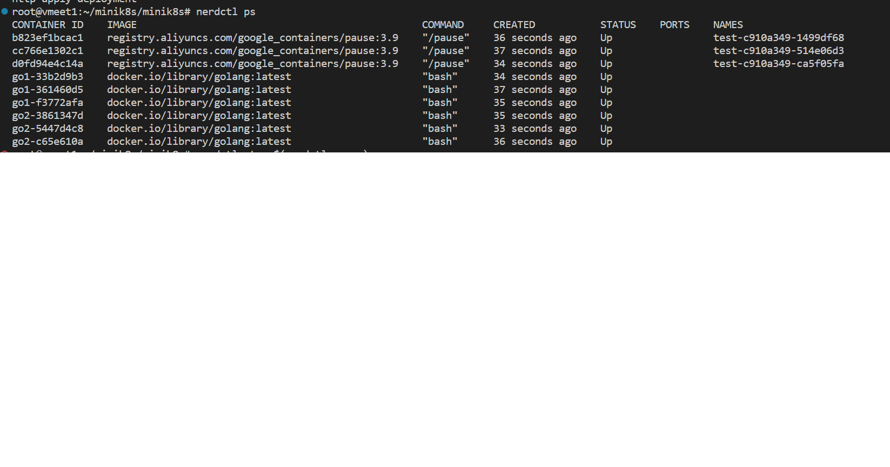

# Deployment Controller 流程

### 启动

`./bin/apiserver`启动apiserver  
`./bin/kubelet`启动kubelet  
`./bin/kube-controller-manager`启动所有controller  

### 使用Deployment controller创建deployment实例  

`./bin/kubectl apply <filename>`(expmple: `./bin/kubectl apply ./cmd/kubectl/app/src/test_deployment.yaml`)创建deployment实例  
`nerdctl ps`可以看到启动了`replicas`数量的pod和container  

