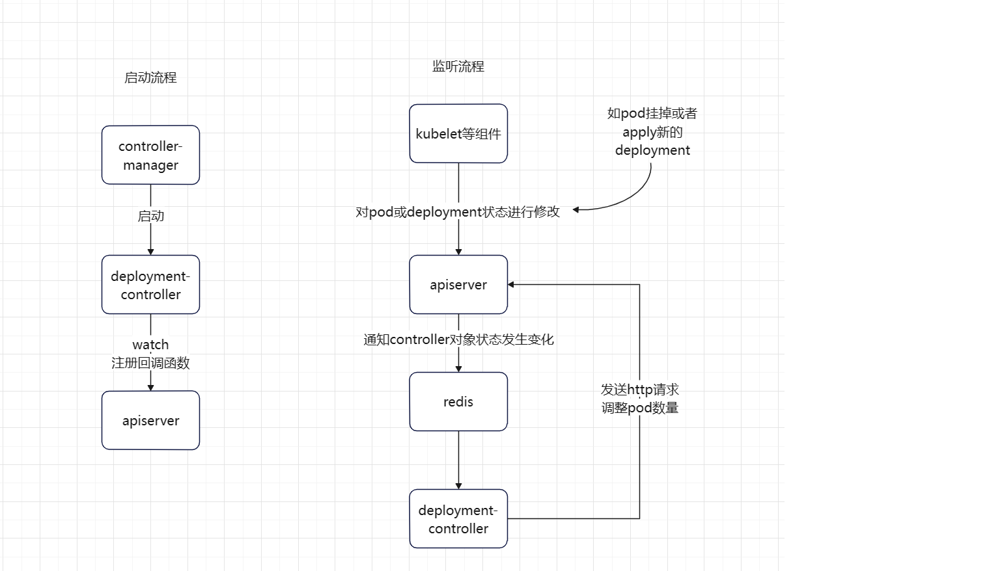

# Deployment Controller 流程

### 启动

启动`kube-controller-manager`时会启动一系列的controller，包括`deployment controller`，`deployment controller`创建完成后会向redis注册watch的回调函数

### 监听

其他组件如kubelet改变pod和deployment状态的时候，apiserver会向controller发送消息，通知状态变化，controller处理完后向apiserver发送消息修改状态

