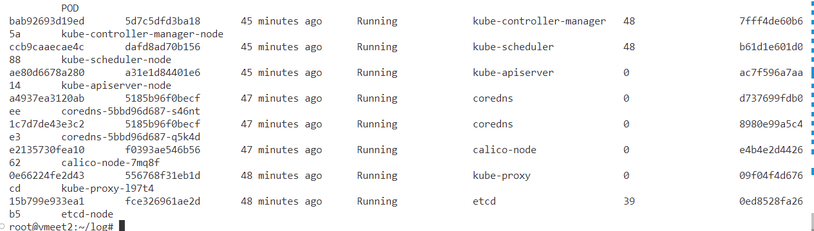

- Q1
  - K8s安装配置方法：
    -   配置dns解析
    ```
    #master:
    $ sudo hostnamectl set-hostname k8s-master
    $ sudo vim /etc/hosts
    192.168.1.200 k8s-master
    192.168.1.201 k8s-node

    #node:
    $ sudo hostnamectl set-hostname k8s-node
    $ sudo vim /etc/hosts
    192.168.1.200 k8s-master
    192.168.1.201 k8s-node
    ```
    -   安装Containerd（安装最新版）
    ```
    sudo apt install \
    ca-certificates \
    curl \
    gnupg \
    lsb-release

    sudo mkdir -p /etc/apt/keyrings
    curl -fsSL https://download.docker.com/linux/ubuntu/gpg | sudo gpg --dearmor -o /etc/apt/keyrings/docker.gpg

    echo \
      "deb [arch=$(dpkg --print-architecture) signed-by=/etc/apt/keyrings/docker.gpg] https://download.docker.com/linux/ubuntu \
      $(lsb_release -cs) stable" | sudo tee /etc/apt/sources.list.d/docker.list > /dev/null

    sudo apt update
    sudo apt install containerd.io
    ```
    -   修改配置
    ```
    mkdir -p /etc/containerd				#创建一个目录用于存放containerd的配置文件
    containerd config default | sudo tee /etc/containerd/config.toml	#把containerd配置导出到文件


    vim /etc/containerd/config.toml			#修改配置文件
    [plugins."io.containerd.grpc.v1.cri"]
    ..................................

    #搜索sandbox_image，把原来的k8s.gcr.io/pause:3.6改为
    "registry.aliyuncs.com/google_containers/pause:3.9" 
    sandbox_image = "registry.aliyuncs.com/google_containers/pause:3.9"	 
    [plugins."io.containerd.grpc.v1.cri".containerd.runtimes.runc.options]
    ..........................			

    #搜索config_path，配置镜像加速地址（这是一个目录下面创建）
    [plugins."io.containerd.grpc.v1.cri".registry]
         config_path = "/etc/containerd/certs.d"			

    #创建镜像加速的目录 
    mkdir /etc/containerd/certs.d/docker.io -pv
    #配置加速
    cat > /etc/containerd/certs.d/docker.io/hosts.toml << EOF
    server = "https://docker.io"
    [host."https://xxxxxx.mirror.aliyuncs.com"]
      capabilities = ["pull", "resolve"]
    EOF

    #加载containerd的内核模块
    cat <<EOF | sudo tee /etc/modules-load.d/containerd.conf
    overlay
    br_netfilter
    EOF
    sudo modprobe overlay
    sudo modprobe br_netfilter

    #重启containerd
    systemctl restart containerd 
    systemctl status containerd
    ```
    -   安装依赖组件
    ```
    sudo apt-get install -y apt-transport-https ca-certificates curl
    ```
    -   配置密钥
    ```
    sudo curl -fsSLo /usr/share/keyrings/kubernetes-archive-keyring.gpg  https://mirrors.aliyun.com/kubernetes/apt/doc/apt-key.gpg
    sudo echo "deb [signed-by=/usr/share/keyrings/kubernetes-archive-keyring.gpg] http://mirrors.aliyun.com/kubernetes/apt kubernetes-xenial main" | sudo tee /etc/apt/sources.list.d/kubernetes.list
    ```
    -   安装K8s
    ```
    sudo apt-get update
    sudo apt-get install -y kubelet kubeadm kubectl
    systemctl enable --now kubelet
    ```
    -   运行配置文件（config.yaml是在默认配置的基础上进行修改的，主要修改了pause镜像的地址）
    ```
    kubeadm init --config config.yaml即可
    ```
    -   配置网络组件
    ```
    wget https://docs.projectcalico.org/v3.15/manifests/calico.yaml
    mkdir -p $HOME/.kube
    sudo cp -i /etc/kubernetes/admin.conf $HOME/.kube/config
    sudo chown $(id -u):$(id -g) $HOME/.kube/config
    export KUBECONFIG=/etc/kubernetes/admin.conf
    然后在node节点运行kubeadm join指令即可
    ```
- Q2:
  - master截图
  
  - node截图
  
  - 作用说明：
    - Master：
      - 首先是以容器的形式运行的pause进程，主要在于管理网络和共享卷
      - api_server，用于接收来自node的请求，以及与etcd交互
      - kubectl-controller-manager:负责统一管理与运行不同的 Controller ，实现对集群内的 Node、Pod 等所有资源的管理。
      - etcd：维护集群的状态
      - scheduler:决定Pod运行在哪个Node上面
      - kubelet：管理系统级别的容器
    - Node：
      - kubelet：管理对应Node中的镜像，和master的api-server交互
- Q3:
  - master截图
  
  - node截图
  
  - 简要说明
    - master中运行了域名解析的服务器(coredns),api_server,kubectl-controller-manager,etcd,scheduler,kube-proxy，calico-node,基本所有的系统组件都被运行了。
    - node中仅仅运行了kube-proxy和calico-node，其他的组件都没有被运行。
- Q4:
  - yaml文档如下
    ```
    apiVersion: v1
    kind: Pod
    metadata:
      name: file-system
    spec:
      volumes:
      - name: shared-data
        emptyDir: {}

      containers:

      - name: nginx-fileserver
        image: hejingkai/fileserver:latest
        volumeMounts:
        - name: shared-data
          mountPath:  /usr/share/nginx/html/files
        ports:
        - containerPort: 8080

      - name: downloader
        image: hejingkai/downloader:latest
        volumeMounts:
        - name: shared-data
          mountPath: /pod-data
        ports:
        - containerPort: 3000
    ```
- Q5:
  - 区别：Worker Node中多了两个Running的容器，分别是downloader和nginx-fileserver，Master Node中容器个数没变。
  - nginx-fileserver容器：⽂件⽬录共享服务。将主要⽬录下的所有⽂件对外共享
  - downloader容器：提供⽂件下载服务
- Q6:
  - 示意图：
  
  这张图片很好的诠释了Pod之间通讯的原理，首先会修改iptable和route table，然后会模拟一个虚拟设备，一端和容器的eth0连接，另一端和主机的eth0连接（通过ip link和ip addr可以看出），由于我的两台主机并不存在跨网段的问题，因此这张图片很好地展示了通讯的过程和原理。
- Q7:
  - 所需的yaml文件
  ```
  apiVersion: apps/v1
  kind: Deployment
  metadata:
    name: file-deployment
    labels:
      app: files
  spec:
    replicas: 3
    selector:
      matchLabels:
        app: files
    template: 
      metadata: 
        labels:
          app: files
      spec:
        volumes:
        - name: shared-data
          emptyDir: {}

        containers:

        - name: nginx-fileserver
          image: hejingkai/fileserver:latest
          volumeMounts:
          - name: shared-data
            mountPath:  /usr/share/files
          ports:
          - containerPort: 8080

        - name: downloader
          image: hejingkai/downloader:latest
          volumeMounts:
          - name: shared-data
            mountPath: /data
          ports:
          - containerPort: 3000
  ```
- Q8：
  - 在这种模式之下，不同Pod的文件不共享文件
  - 使用出现的效果，原本下载过的文件在Pod崩溃之后，数据会消失，这时候我们无法获得之前下载过的文件
  - 修改Pod的volume属性，让这些Pod的volume mount到主机相同的路径的目录之下。实现不同Pod之间的共享存储
- Q9:
  - yaml文件格式：
  ```
  apiVersion: v1             #API的版本号，版本号可以用 kubectl api-versions 查询到
  kind: Service              #表明资源对象，例如Pod、RC、Service、Namespace及Node等  
  metadata:                  #资源对象的元数据定义
    name: file-service        #service名称
  spec:                      #资源对象的详细定义，持久化到etcd中保存
    type: ClusterIP          #Service类型，ClusterIP供kubernates集群内部pod访问
    ports:                   #暴露的端口列表
    - port: 8080             #Service监听的端口，对应ClusterIP，即ClusterIP+ServicePort供集群内部pod访问的
      targetPort: 8080       #对应pod中容器的端口
      protocol: TCP          #协议，支持TCP、UDP，默认TCP
      name: server           #端口名称
    - port: 3000             #Service监听的端口，对应ClusterIP，即ClusterIP+ServicePort供集群内部pod访问的
      targetPort: 3000       #对应pod中容器的端口
      protocol: TCP          #协议，支持TCP、UDP，默认TCP
      name: downloader       #端口名称
    selector:                #label选择器，管理label对应的pod
      app: files             #pod的label
  ```
- Q10:
  - 与Service访问相关的iptable规则
  ```
  相关Service的ip和port配置
  -A KUBE-SERVICES -d 10.98.1.99/32 -p tcp -m comment --comment "default/file-service:server cluster IP" -m tcp --dport 8080 -j KUBE-SVC-COMXBCNV7G2LU7HZ
  -A KUBE-SERVICES -d 10.98.1.99/32 -p tcp -m comment --comment "default/file-service:downloader cluster IP" -m tcp --dport 3000 -j KUBE-SVC-JLZ7T6AJDZOSYTPJ
  
  file-server:server Service的相关规则:
  -A KUBE-SVC-COMXBCNV7G2LU7HZ -m comment --comment "default/file-service:server -> 192.168.227.2:8080" -m statistic --mode random --probability 0.33333333349 -j KUBE-SEP-SIILC6AG5NPALGLX
  -A KUBE-SVC-COMXBCNV7G2LU7HZ -m comment --comment "default/file-service:server -> 192.168.227.3:8080" -m statistic --mode random --probability 0.50000000000 -j KUBE-SEP-KEG736ILYDYGCSSB
  -A KUBE-SVC-COMXBCNV7G2LU7HZ -m comment --comment "default/file-service:server -> 192.168.227.4:8080" -j KUBE-SEP-AHGZIZEZRPI3BWMK

  file-server:server的DNAT的转换功能：
  -A KUBE-SEP-SIILC6AG5NPALGLX -s 192.168.227.2/32 -m comment --comment "default/file-service:server" -j KUBE-MARK-MASQ
  -A KUBE-SEP-SIILC6AG5NPALGLX -p tcp -m comment --comment "default/file-service:server" -m tcp -j DNAT --to-destination 192.168.227.2:8080
  （没有全部截图，仅仅记录一个replica的iptable说明情况，其余的同理）
  
  file-server:downloader Service的相关规则:
  -A KUBE-SVC-JLZ7T6AJDZOSYTPJ -m comment --comment "default/file-service:downloader -> 192.168.227.2:3000" -m statistic --mode random --probability 0.33333333349 -j KUBE-SEP-QXQXLTWV7Z5XTGJT
  -A KUBE-SVC-JLZ7T6AJDZOSYTPJ -m comment --comment "default/file-service:downloader -> 192.168.227.3:3000" -m statistic --mode random --probability 0.50000000000 -j KUBE-SEP-6272CBN7HHI4UZ4O
  -A KUBE-SVC-JLZ7T6AJDZOSYTPJ -m comment --comment "default/file-service:downloader -> 192.168.227.4:3000" -j KUBE-SEP-F5QCTM5KAAUVEQGD

  file-server:downloader的DNAT的转换功能：
  -A KUBE-SEP-QXQXLTWV7Z5XTGJT -s 192.168.227.2/32 -m comment --comment "default/file-service:downloader" -j KUBE-MARK-MASQ
  -A KUBE-SEP-QXQXLTWV7Z5XTGJT -p tcp -m comment --comment "default/file-service:downloader" -m tcp -j DNAT --to-destination 192.168.227.2:3000
  （没有全部截图，仅仅记录一个replica的iptable说明情况，其余的同理）
  ```
  - 简要解释：
  ```
  首先从iptable的信息可以看出k8s给Service分配了10.98.1.99/32的Cluster ip以及对应的port(在yaml文件中已经声明)，然后在后面添加对应服务到对应Pod ip和对应端口的映射。同时从后面的条目中我们可以看出，每个条目后面跟随着对应条目被选中的概率，分别是0.33，0.5，1，根据概率论的相关计算，这三个备份被选为服务的概率是一样的(都是三分之一)，实现了负载均衡。
  ```
- Q11：
  - 每次创建/删除 Service 或修改 Endpoints 时（例如，如果由于相关应用的 scale 而导致底层 Pod 数量发生变化），kube-proxy 都会负责更新集群每个节点上的 iptables 规则。保证请求可以被正常地转发到对应的Pod。
- Q12:
  - deployment的配置修改 --- 增加了cpu资源的使用限制
  ```
  resources:
          limits:
            cpu: 500m
          requests:
            cpu: 200m
  ```
  - 生成的hpa yaml配置文件
  ```
  apiVersion: autoscaling/v2
  kind: HorizontalPodAutoscaler
  metadata:
    creationTimestamp: "2023-05-06T13:21:55Z"
    name: file-deployment
    namespace: default
    resourceVersion: "2897"
    uid: 8bcabd58-2cd4-4dbe-b138-da34b5ae1d77
  spec:
    maxReplicas: 6
    metrics:
    - resource:
        name: cpu
        target:
          averageUtilization: 40
      type: Resource
    minReplicas: 3
    scaleTargetRef:
      apiVersion: apps/v1
      kind: Deployment
      name: file-deployment
  ```
- Q13:
  - 对应的yaml配置文件
  ```
  apiVersion: autoscaling/v2
  kind: HorizontalPodAutoscaler
  metadata:
    creationTimestamp: "2023-05-06T13:21:55Z"
    name: file-deployment
    namespace: default
    resourceVersion: "2897"
    uid: 8bcabd58-2cd4-4dbe-b138-da34b5ae1d77
  spec:
    behavior:
      scaleDown:
        policies:
        - type: Percent
          value: 10
          periodSeconds: 60
    maxReplicas: 6
    metrics:
    - resource:
        name: cpu
        target:
          averageUtilization: 40
          type: Utilization
      type: Resource
    minReplicas: 3
    scaleTargetRef:
      apiVersion: apps/v1
      kind: Deployment
      name: file-deployment
  ```