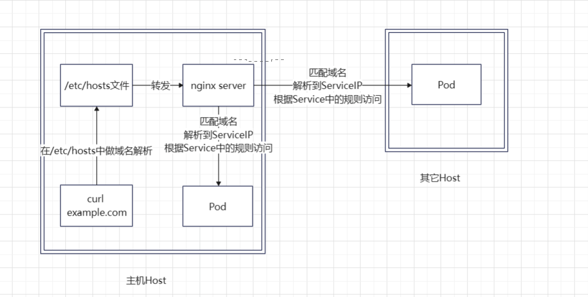
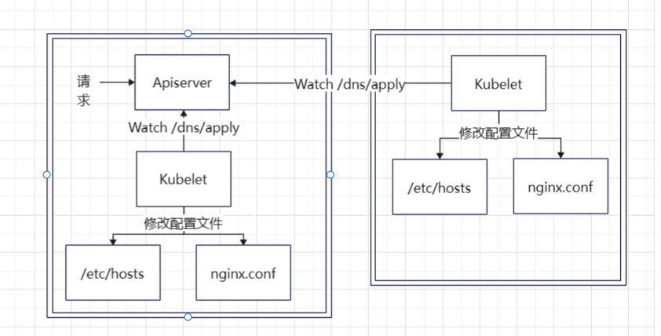

# Nginx

> Minik8s用Nginx做DNS Server，具体的逻辑如下

## 1. 整体架构



> 上图是DNS服务的调用链，通过Nginx以及主机的/etc/hosts实现了域名到ServiceIP的映射



> 上图演示了Minik8s如何修改/etc/hosts文件以及nginx的配置文件，以实现DNS的apply


## 2. 如何配置Nginx
```
$ mkdir -p /var/run/nginx
```

[nginx安装及其配置详细教程 - 知乎 (zhihu.com)](./img/nginx-conf-modification.png)

[ubuntu下安装nginx时依赖库zlib，pcre，openssl安装方法-阿里云开发者社区 (aliyun.com)](https://developer.aliyun.com/article/689686)


## 3. 注意事项

1. **在调用DNS Apply之前要确保Nginx正在运行！！！**