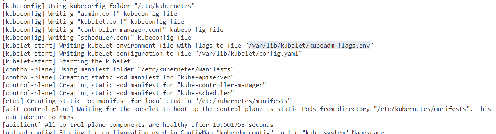
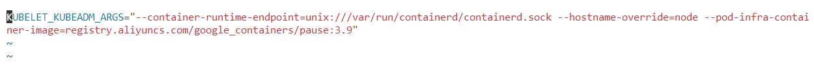

# Source Reading

-   crictl的使用：
    -   `crictl pull image_name`：可以拉取一个镜像，但是仍然有具体的配置没有设置
-   kubeadm源码解读：
    -   `SubCmdRun()`方法简单的说就是要求一定后面要有子命令，否则打印用法并正常返回：如kubeadm config + subcmd
    -   `kubeadm config images pull --config xxx.yaml`指令学习：
        -   在最内层的`newCmdConfigImagesPull`函数内部解析了最后的pull子命令，通过`cmd.PersistentFlags()`方法返回flagset对象（表示这个flag可以被子命令共用），通过`AddImagesCommonConfigFlags`接口添加了很多flag，但是我们仅仅需要config flag，相当于通过yaml文件来初始化配置，通过`AddCRISocketFlag`添加对应的容器运行时的连接的url。
        -   通过一层层调用，在最后，我们需要调用最后的一个yaml解析器去解析yaml文件，在`staging/src/k8s.io/apimachinery/pkg/util/yaml`目录下，这里面会对于yaml文件的读取以及解析进行操作。
        -   yaml的文件解析是以`---`作为分隔符的。`YAMLReader`一次只会读出一个yaml document (以`---`分隔).
        -   `interface{}`相当于any type
        -   配置文件的读取,首先通过yaml文件的分隔符(`---`)进行分隔,然后读取对应的版本和kind,分别表示k8s版本和配置信息对应的配置对象,前者可以舍弃.通过`GroupVersionKind`对象建立从该对象到对应的yaml文件内容的映射,然后从中解析出`InitConfiguration`和`ClusterConfiguration`然后将`ClusterConfiguration`合并到`InitConfiguration`的成员对象中,在后面通过读取`InitConfiguration`中的镜像地址的对象得到拉取的镜像地址,然后调用`os.exec`去拉取对应的镜像.
    -   `kubeadm init --config xxx.yaml`指令学习
        -   这个指令可以配置的指令很多,这里我们仅仅研究`config` flag,传入一个配置文件进行解析.
        -   首先对于InitRunner进行学习，这个类对于工作流（workflow）进行抽象，分成多个Phase进行执行
            -   `computePhaseRunFlags`会根据`RunOption`来决定哪些Phase需要执行，哪些不需要。
        - Init指令的第一个Phase的工作是：PreflightPhase，主要的工作是拉取对应的镜像。
        - Init指令的第二个Phase的工作是：CertsPhase，主要是生成对应的证书。
        - Init指令的第三个Phase的工作是：KubeConfigPhase，看到这个函数，合理推测是因为采用的https协议，所以需要证书，如果采用http协议，说不定这一部分可以省略。这个Phase在生成config文件时，需要根据配置文件的相关参数（如Cluster Name）建立对应的`KubeConfig`对象。然后持久化到disk上（以配置文件的形式，如admin.conf）
        ```
          func formatURL(host, port string) *url.URL {
          	return &url.URL{
          		Scheme: "https",
          		Host:   net.JoinHostPort(host, port),
          	}
          }
        ```
        - Init指令的第四个Phase的工作是：KubeletStartPhase，主要的作用是设置并启动Kubelet，通过`NodeRegistrationOptions`结构体来限制可以加入集群的node（具体看源码），从vmeet2的实验结果来看，kubelet的环境变量被存到系统指定的文件中，存储结果如下（后面可能会用到）,kubelet的配置文件会被存储到/var/lib/kubelet/config.yaml下，内容和`--config`传入的配置文件的内容一样。在启动kubelet时会判断kubelet是否active，通过命令行工具（如systemctl系统，则运行systemctl status kubelet），理解就是kubelet相当于已经安装在系统中了，通过systemctl来启动和查看状态。
        
        
        - Init指令的第五个Phase的工作是：ControlPlanePhase，这个过程会把对应的Pod的配置文件写到对应的目录中（api-server.yaml对应api-server的配置文件）。这里会开始建立Volume的映射关系，由于`api-server`,`scheduler`,`controllerManager`等都是以容器的形式在运行的，因此，通过建立Volume映射，可以保证这些系统可以读取到对应的配置。在建立起这些配置后（生成Pod配置文件），把对应的Pod配置持久化到disk中（ps.从文件内容可以看到Pod声明文件的格式）。
        - Init指令的第六个Phase的工作是EtcdPhase，即生成Etcd的对应的Pod的配置文件
        - Init指令的第七个Phase的工作是，等待所有的系统级别的Pod启动完毕，采用NewKubeWaiter进行等待后台的kubelet去启动对应的系统级别的Pod，会通过心跳检测来判断整个系统是否已经启动。
    -   Kubelet的学习（如何启动并管理系统级别的container）
        -   作用：Kubelet基于PodSpec（形容Pod对象状态的对象）工作，确保这些PodSpec描述的容器的运行状态正常。除了api-server以外，还有两种方式可以把容器清单提供给Kubelet。
            -   First，命令行传入文件路径，然后定时检测
            -   Second，命令行传入HTTP端口，然后定时检测
    -   关于Runc的配置：
        -   首先Pod创建失败的问题
            -   1，由于CNI没有配置的原因
                -   配置方法
                ```
                首先配置网络插件（CNI 插件）：
                    wget https://github.com/containernetworking/plugins/releases/download/v0.9.1/cni-plugins-linux-amd64-v0.9.1.tgz（版本可以去对应的地址下载最新版）

                    mkdir -p /opt/cni/bin/
                    mkdir -p /etc/cni/net.d

                    tar -zxvf cni-plugins-linux-amd64-v0.9.1.tgz -C /opt/cni/bin/
                ```
                ```
                拉取CNI源码编译安装
                git clone https://github.com/containernetworking/cni.git
                cd cni
                go mod tidy
                cd cnitool
                GOOS=linux GOARCH=amd64 go build .
                ```
                将编译的cnitool可执行文件拷贝到服务器的/opt/cni/bin目录下,并建立对应的软链接
                ```
                cp cnitool /opt/cni/bin/
                chmod +x /opt/cni/bin/cnitool
                ln -s /opt/cni/bin/cnitool /usr/local/bin/cnitool
                ```
                创建containerd容器使用cni的配置文件:
                ```
                cat << EOF | tee /etc/cni/net.d/connet.conf
                {
                    "cniVersion": "0.4.0",
                    "name": "connet",
                    "type": "bridge",
                    "bridge": "cni0",
                    "isDefaultGateway": true,
                    "forceAddress": false,
                    "ipMasq": true,
                    "hairpinMode": true,
                    "ipam": {
                        "type": "host-local",
                        "subnet": "10.88.0.0/16"
                    }
                }
                EOF
                ```
                创建一个名为connet的network namespace
                ```
                ip netns add connet

                ip netns list
                connet(expected output)

                ls /var/run/netns/
                connet(expected output)
                ```
                向这个network namespace中添加网络:
                ```
                export CNI_PATH=/opt/cni/bin
                cnitool add connet /var/run/netns/connet
                cnitool check connet /var/run/netns/connet
                ```
                测试网络是否工作:
                ```
                ip -n connet addr
                ping 10.88.0.2
                ```
            -   2，由于驱动出错的原因：修改Containerd的SystemCGroup配置为false
            -   3，还有可能是由于containerd的配置文件没有配置加速器（如阿里云的镜像地址作为备用地址），导致至关重要的pause镜像拉不下来